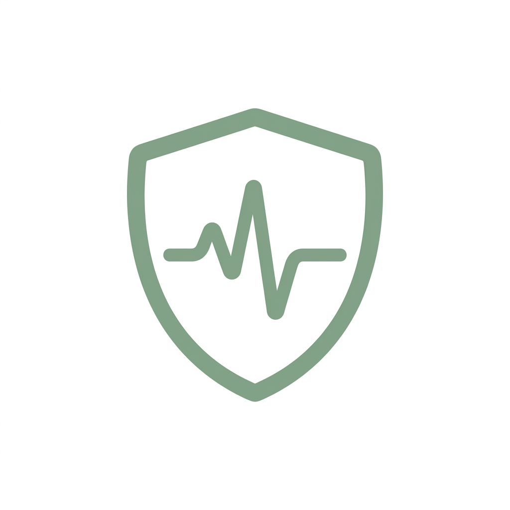

<div align="center">
  
  <h1>💊 UbatLah</h1>
  <p><strong>A Context-Aware Medication Safety & Verification Assistant</strong></p>
</div>

---

**UbatLah** (formerly MediSafe) is an intelligent web application designed to enhance medication safety for patients in Malaysia. By combining Optical Character Recognition (OCR), official drug registry lookups, global pharmaceutical data, and AI-driven insights, UbatLah empowers users to verify their medications and understand them in the context of their own health conditions.

## ✨ Features

- 📸 **Label Scanning & OCR**: Upload a photo of your medicine label. UbatLah uses **Gemini 2.5 Flash Vision** (with Tesseract fallback) to accurately extract and reconstruct the medicine's name, dosage, and brand—even from curved bottles.
- 🇲🇾 **NPRA Verification**: The extracted medicine is cross-referenced with the **National Pharmaceutical Regulatory Agency (NPRA)** database to ensure the product is officially registered and certified in Malaysia.
- 🌍 **OpenFDA Integration**: Automatically retrieves detailed medication facts, including active ingredients, usage instructions, side effects, and contraindications directly from the U.S. FDA.
- 🏥 **Patient Context & RAG**: Upload patient medical history (PDFs). UbatLah indexes this data using a local vector database (**ChromaDB**) and uses Retrieval-Augmented Generation (RAG) to tailor medication summaries and warnings specifically to the patient's allergies and existing conditions.
- 💬 **Interactive AI Chat**: Have follow-up questions? Chat directly with the clinical AI assistant to ask about interactions, missed doses, or side effects.

## 🏗 Architecture

UbatLah is built with a modern, decoupled tech stack:

- **Frontend**: A sleek, responsive user interface built with **Next.js** (React), styled using custom CSS and Tailwind principles for a premium glassmorphic aesthetic.
- **Backend**: A high-performance **FastAPI** (Python) service that orchestrates:
  - OCR pipelines (`gemini-2.5-flash`, `pytesseract`)
  - Fast, in-memory NPRA CSV database matching
  - RAG indexing (`SentenceTransformers`, `chromadb`, `pypdf`)
  - AI reasoning and response generation (`google-genai`)

## 🚀 Getting Started

### Prerequisites

- **Node.js** (v18+)
- **Python** (v3.10+)
- **Gemini API Key**: Required for vision OCR and the chat assistant.

### 1. Backend Setup (FastAPI)

```bash
cd backend

# Create a virtual environment and activate it
python3 -m venv venv
source venv/bin/activate  # On Windows: venv\Scripts\activate

# Install dependencies
pip install -r requirements.txt

# Set your Gemini API key (create a .env file or export it)
export GEMINI_API_KEY="your_api_key_here"

# Run the backend development server
python -m uvicorn app.main:app --reload
```
*The backend will be available at `http://localhost:8000`.*

### 2. Frontend Setup (Next.js)

```bash
cd frontend

# Install dependencies
npm install

# Set the backend URL if running on a different port (optional)
export NEXT_PUBLIC_API_URL="http://localhost:8000"

# Run the frontend development server
npm run dev
```
*The web interface will be available at `http://localhost:3000`.*

## 🔒 Privacy & Data
UbatLah uses local vector databases for patient file processing. Patient files (PDFs) are chunked and stored locally on your server inside ChromaDB. Only the relevant context retrieved during an active chat session is sent to the LLM. 

## 📝 License
This project is for educational and demonstrative purposes, showcasing the potential of multimodal AI and RAG in the healthcare domain.

---

<div align="center">
  <p>Built with ❤️ for medication safety.</p>
</div>
