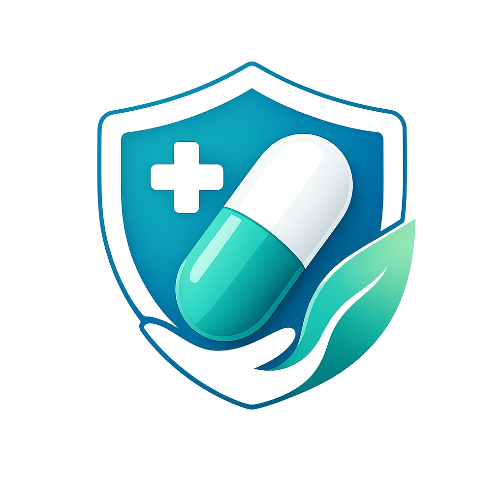
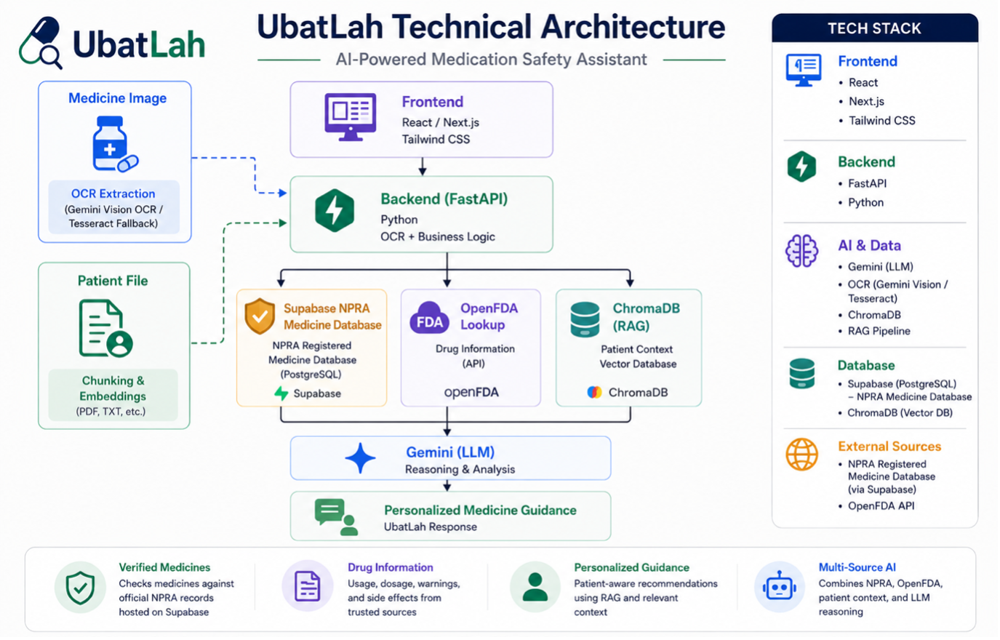

#  UbatLah

**UbatLah** is an AI-powered medication safety and verification assistant designed for the Malaysian healthcare ecosystem.

The platform combines official medicine verification, structured pharmaceutical data, patient-specific medical context, and conversational AI to help users make safer medication-related decisions.

Rather than functioning as a generic chatbot, UbatLah integrates:

- 🇲🇾 NPRA Registered Medicine Database
- 🌍 OpenFDA Drug Information
- 🏥 Retrieval-Augmented Generation (RAG)
- 🤖 Gemini AI Reasoning

to provide contextual, explainable, and personalized medication guidance.

---

## ✨ Key Features

### 📸 Medicine Verification
- Upload medicine packaging or labels
- OCR extracts medicine information
- Verifies products against the NPRA registered medicine database

### 🌍 Drug Information
- Retrieves usage, dosage, side effects, and warnings from OpenFDA
- AI-generated fallback explanations when structured data is unavailable

### 🏥 Patient-Aware Guidance
- Upload medical reports and patient history
- Uses RAG + ChromaDB to retrieve relevant patient context
- Generates personalized medication recommendations

### 💬 AI Chat Assistant
- Ask follow-up medication questions
- Combines:
  - NPRA verification
  - OpenFDA information
  - Patient context
  - Gemini reasoning

---

## 🏗 Architecture

<div align="center">
  
</div>

---

## ⚙️ Tech Stack

### Frontend
- Next.js
- React
- Tailwind CSS

### Backend
- FastAPI
- Python

### AI & Data
- Gemini 2.5 Flash
- Gemini Vision OCR
- Tesseract OCR
- ChromaDB
- RAG Pipeline

### External Sources
- Supabase PostgreSQL
- NPRA Registered Medicine Dataset
- OpenFDA API

---

## 🚀 Getting Started

### Backend

```bash
cd backend

python3 -m venv venv
source venv/bin/activate

pip install -r requirements.txt

python -m uvicorn app.main:app --reload
```

### Frontend

```bash
cd frontend

npm install
npm run dev
```

---

## 🎯 Why UbatLah Is Different

Most medication chatbots rely entirely on an LLM.

UbatLah follows a source-priority architecture:

1. NPRA Verification
2. OpenFDA Information
3. Patient Context (RAG)
4. Gemini Reasoning

This reduces hallucinations and improves reliability by prioritizing factual healthcare sources before AI-generated explanations.

---

## 🔮 Future Improvements

### Automated NPRA Synchronization

Currently, NPRA data is imported from the public data.gov.my dataset.

Future versions can automate:

```text
data.gov.my
      ↓
Scheduled ETL Pipeline
      ↓
Data Validation
      ↓
Supabase Update
      ↓
Version Tracking
```

to keep medicine records continuously updated.

---

### Mobile-First Experience

Potential migration to Flutter for:

- Camera-first medicine scanning
- Push notifications
- Medication reminders
- Improved patient accessibility

---